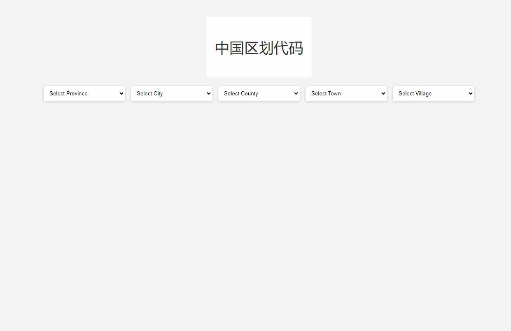

## 项目说明：

> 本项目为中国行政区划数据，包括省、市、区县、乡镇街道、社区村 五级行政区划数据。

## 项目结构
```shell
regions_data
├── api                        # 接口
│  ├── index.py                   # 接口文件
│  └── __init__.py
├── data                       # 处理后数据【可直接使用】
│  ├── csv                        # csv 格式数据
│  │  ├── city.csv                     # 市数据
│  │  ├── county.csv                   # 区县数据
│  │  ├── province.csv                 # 省数据
│  │  ├── town.csv                     # 乡镇街道数据
│  │  └── village.csv               # 村社区数据【文件较大已压缩,解压使用】
│  ├── json                       # json 格式数据
│  │  ├── city.json                     # 市数据
│  │  ├── county.json                   # 区县数据
│  │  ├── province.json                 # 省数据
│  │  ├── town.json                     # 乡镇街道数据
│  │  └── village.json.7z               # 村社区数据【文件较大已压缩,解压使用】
│  ├── sqlite                     # sql 格式数据
│  │  └── regions.db.7z                 # db数据文件【文件较大已压缩,解压使用】
│  ├── data_ops.py                # 数据操作
│  ├── data2csv.py                # json数据转为csv数据操作
│  └── main.py                    # 入口
├── data_                      # 获取数据
│  ├── database_ops.py            # 数据操作
│  ├── fetch_data.py              # 获取数据
│  ├── main.py                    # 入口
│  └── time_logger.py             # 记录时间
├── templates                  # 页面
│  └── index.html               
├── .gitignore                 # 忽略文件配置 
├── main.py                    # 服务
├── README.md                  # 说明文档
├── regions.db                 # 初始版本数据db文件【不建议直接使用】
├── requirements.txt           # 版本管理
└── vercel.json                # vercel 配置文件
```

## 支持数据格式：

- SQL

  > db数据文件
  >
  > 文件位置: `根目录/data/sqlite/regions.db.7z` 【解压后可直接使用数据库连接工具打开】

- JSON

  > Json格式数据文件
  >
  > 文件位置: `根目录/data/json/`目录下

- CSV

  > csv格式数据文件
  >
  > 文件位置: `根目录/data/csv/`目录下

## 数据来源：

> 国家统计局：
> https://www.stats.gov.cn/sj/tjbz/tjyqhdmhcxhfdm/2023/
>
> 【2023 年度全国统计用区划代码和城乡划分代码更新维护的标准时点调整为 2023 年 6 月 30 日】
> 
>  根据国家统计局政府信息公开相关要求，自2024年10月起，国家统计局继续公开《关于统计上划分城乡的规定》《统计用区划代码和城乡划分代码编制规则》等统计标准方法，不再公开具体相关代码。

## 数据同步时间：【2024-06-07】

## 声明：

> 本项目仅供交流学习使用，请勿用于违法用途，如有侵权，请联系删除。

## 使用方法：

### 方式一：【获取最新数据】
> 1. 拉取本项目
> 2. 修改`main.py` 中 `base_url` 地址
> 3. 安装依赖：`pip install -r requirements.txt`
> 4. 运行：`python data_/main.py`
> 5. 生成的数据文件保存在根目录下 `regions.db` 中

### 方式二：【直接使用已有数据】

> 项目根目录`data`目录下的 `Sql`数据文件、`Json`格式数据文件


### 预览效果

#### 在线预览

> 访问: `https://regions-data.vercel.app/`

#### 本地预览
> 1. 根目录运行： `python main.py`
> 2. 访问：      `http://127.0.0.1:8000/`

效果图：



## 如何贡献

非常欢迎你的加入！[提一个 Issue](https://github.com/slightlee/regions_data/issues/new/choose) 或者提交一个 Pull Request。

**Pull Request:**

1. Fork 代码
2. 创建自己的分支: `git checkout -b feat/xxxx`
3. 提交你的修改: `git commit -am 'feat(function): add xxxxx'`
4. 推送您的分支: `git push origin feat/xxxx`
5. 提交`pull request`


## 拓展

> 1. 生成`requirements.txt`文件命令： `pipreqs ./ --encoding=utf8`
